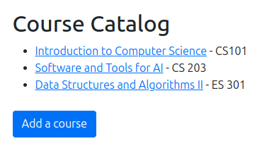
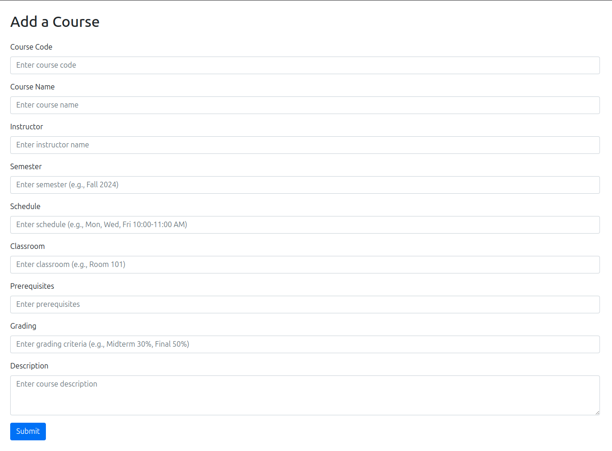
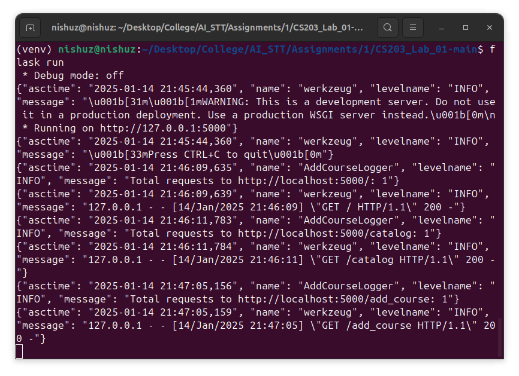
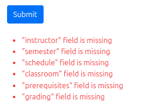
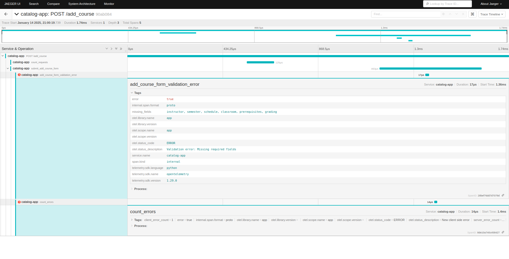
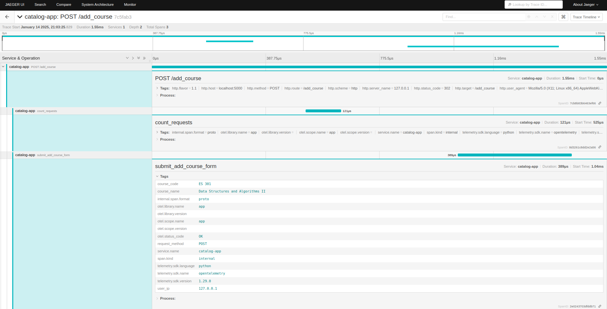

# **CS203: Software Tools & Techniques for AI**
## **Lab 01: Distributed Tracing and Telemetry (https://github.com/nishchaybhutoria/CS203_Lab_01-main)**
**IIT Gandhinagar, Sem II - 2024-25**

## **Team Members**
- Nishchay Bhutoria (23110222)
- Srivaths P (23110321)

---

## **Introduction**
This lab submission demonstrates the use of distributed tracing and telemetry in a Flask-based Course Information Portal. Using **OpenTelemetry** and **Jaeger**, we add observability to the application, enabling efficient debugging, performance monitoring, and error tracking.

---

## **Technologies Used**
- **Flask**: Web framework for building the portal.
- **OpenTelemetry**: Framework for generating and exporting telemetry data.
- **Jaeger**: Distributed tracing backend for storing and visualizing traces.
- **python-json-logger**: For structured JSON logging.

---

## **Features**
### **1. Add Courses to the Catalog**
- An "Add a New Course" button on the catalog page navigates to a form for adding courses.

  

  

- Logs are generated for:
  - **Successful course additions** (`INFO` level).
  - **Missing required fields** (`ERROR` level).
- Example log:
  ```json
  {
    "asctime": "2025-01-14 19:21:42,571", 
    "name": "AddCourseLogger", 
    "levelname": "INFO", 
    "message": "Course CS 201 added successfully. All required fields are present."
  }
  ```
- Console logs:

  

---

### **2. OpenTelemetry Tracing**
We instrumented the following routes to provide detailed traces for observability:

#### **Route: `/catalog`**
- **Span Name**: `render_catalog`
- **Attributes**:
  - `request_method`: HTTP method (e.g., `GET`).
  - `user_ip`: User's IP address.
  - `course_count`: Total number of courses loaded.

---

#### **Route: `/add_course`**
1. **Span Name**: `view_add_course_form` (GET request)
   - **Description**: Tracks the rendering of the course addition form.
   - **Attributes**:
     - `request_method`: HTTP method (e.g., `GET`).
     - `user_ip`: User's IP address.

2. **Span Name**: `submit_add_course_form` (POST request)
   - **Description**: Tracks the submission of the course addition form.
   - **Attributes**:
     - `request_method`: HTTP method (e.g., `POST`).
     - `user_ip`: User's IP address.
     - `course_code`: Code of the course being added.
     - `course_name`: Name of the course being added.

3. **Span Name**: `add_course_form_validation_error` (Child Span)
   - **Description**: Captures validation errors during form submission.
   - **Attributes**:
     - `missing_fields`: Fields that are missing in the form.
     - `error_count`: Number of errors (client-side or server-side).

4. **Span Name**: `count_errors` (Child Span)
   - **Description**: Tracks the total number of client-side and server-side errors.
   - **Attributes**:
     - `client_error_count`: Count of client-side errors.
     - `server_error_count`: Count of server-side errors.

---

#### **Route: `/course/<code>`**
- **Span Name**: `view_course`
- **Attributes**:
  - `request_method`: HTTP method (e.g., `GET`).
  - `user_ip`: User's IP address.
  - `course_code`: Code of the course being viewed.
  - `error`: Set to `True` if the course is not found.
  - `error_message`: Error message if the course is not found.


---

### **3. Exporting Telemetry Data to Jaeger**
- Traces include:
  - Total requests to each route.
  - Processing time for operations.
  - Error counts for client-side and server-side errors.
- Screenshot of Jaeger traces:

**Missing Fields:**





The trace data contains exactly which fields are missing and also has an explicit error type.

**Successful Course Addition:**



As visible from the above image, we are able to get metadata about the form submission, such as the course code, course name, etc. as well. 

---

### **4. JSON Logging**
- Structured logs for all events:
  - Example:
    ```json
    {
      "asctime": "2025-01-14 19:21:07,417", 
      "name": "AddCourseLogger", 
      "levelname": "ERROR", 
      "message": "Failed to add course. Missing fields: semester, schedule, classroom, prerequisites, grading"
    }
    ```

---

### **Setup and Execution**
1. **Clone the Repository**:
   ```bash
   git clone https://github.com/nishchaybhutoria/CS203_Lab_01-main.git
   cd CS203_Lab_01-main
   ```

2. **Set Up the Environment**:
   ```bash
   python -m venv venv
   source venv/bin/activate  # On Windows: venv\Scripts\activate
   pip install -r requirements.txt
   ```

3. **Run Jaeger**:
   ```bash
   sudo docker run -d --name jaeger \
       -e COLLECTOR_ZIPKIN_HTTP_PORT=9411 \
       -p 5775:5775/udp \
       -p 6831:6831/udp \
       -p 6832:6832/udp \
       -p 5778:5778 \
       -p 16686:16686 \
       -p 14268:14268 \
       -p 14250:14250 \
       -p 9411:9411 \
       jaegertracing/all-in-one:1.41 --log-level=debug
   ```

4. **Run the Flask Application**:
   ```bash
   flask run
   ```

5. **Access the Application**:
   - Flask App: [http://localhost:5000](http://localhost:5000)
   - Jaeger UI: [http://localhost:16686](http://localhost:16686)
